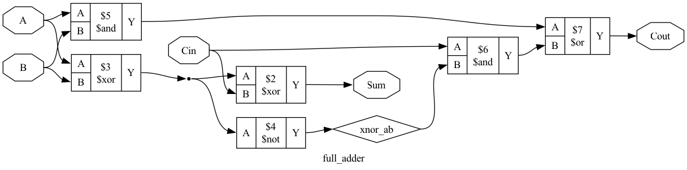
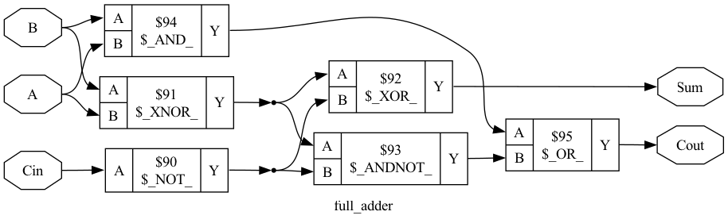

# Local Verilog Agent

## Overview
The Local Verilog Agent is an LLM-powered tool that generates, simulates, and validates Verilog hardware designs. It supports both local execution via **Ollama** and remote inference via **Hugging Face**, allowing for flexible model selection.

## Setup
1.  **Prerequisites**:
    *   Python 3.8+
    *   Icarus Verilog (`brew install icarus-verilog`)
    *   Ollama (`brew install ollama`) with a model like `qwen2.5-coder:14b` or `gpt-oss:20b` pulled.
2.  **Installation**:
    ```bash
    ./setup_venv.sh
    ```

## Usage
### Quick Start
Run the helper script with your design prompt:
```bash
./run_agent.sh "A 4-bit binary up-counter with synchronous reset"
```

### CLI Options
You can also run the python script directly for more control:
```bash
source venv/bin/activate
python src/main.py "Your Prompt" [OPTIONS]
```

**Options:**
*   `--model <name>`: Specify the model name. Overrides `config.yaml`.
*   `--max-retries <int>`: Set the maximum self-correction attempts (default: 5).
*   `--config-file <path>`: Use a custom config file (default: `config.yaml`).

## Agent Workflow
This agent employs a modular, verify-as-you-go approach to hardware design:

1.  **Planning**: The agent first analyzes your prompt and breaks it down into a hierarchical Implementation Plan, identifying necessary submodules and the top-level design.
2.  **Submodule Implementation**: It builds the design bottom-up. Each submodule is generated, its testbench is created, and it is simulated/verified in isolation.
3.  **Context-Aware Integration**: Successfully verified submodules are passed as context to higher-level modules, ensuring that the Top Level module uses correct interfaces.
4.  **Iterative Self-Correction**: If a simulation fails, the agent analyzes the error logs (compilation or logic errors) and iteratively fixes the code or testbench until it passes verification.

## Configuration (`config.yaml`)
The agent is pre-configured via `config.yaml`. You can modify this file to change default behaviors.

```yaml
# Core Settings
prompt: "Design a 8-bit register with active low asynchronous reset"

# LLM Settings
llm:
  provider: "ollama" # Options: "ollama", "huggingface"

  ollama:
    model: "gpt-oss:20b"

  huggingface:
    model: "Qwen/Qwen2.5-Coder-32B-Instruct"
    api_key: "hf_..." 
    api_url: "https://router.huggingface.co/v1/chat/completions"

# Simulation Settings
max_retries: 30        # How many times to attempt self-correction
workspace_dir: "build" # Temporary directory for simulation files

# Output Settings
designs_dir: "designs" # Where successful designs are saved
save_on_success: true  # Set to false to disable saving
show_diffs: true       # Show colorized diffs when the agent fixes code
```

## Prompting Tips
*   **Be Specific**: "A counter" is vague. "A 4-bit synchronous up-counter with active-high reset and enable" is better. The LLM model will infer the rest, which requires more context. Generally, within the context window of your model, the more specific you are, the better. Using GPT-OSS:20b, most specifications less than 800 words worked perfectly fine over about 3 attemptss.
*   **Specify Interface**: If you need specific signal names, list them (e.g., "Inputs: clk, rst, in_a; Output: out_b").
*   **Reset Logic**: Explicitly state "synchronous" or "asynchronous" and "active-high" or "active-low" to ensure the generated testbench matches the design.

## Example Output
Here is an example of a successfully generated design for the prompt:
> "A full adder using XOR gates"

### Generated Diagrams
The agent automatically generates high-level architecture and gate-level synthesized diagrams.

**RTL Architecture (High Level):**


**Gate-Level Logic (Synthesized):**


### Unified Report
A comprehensive PDF report containing diagrams is also generated: [View Report](../examples/full_adder/report.pdf)
